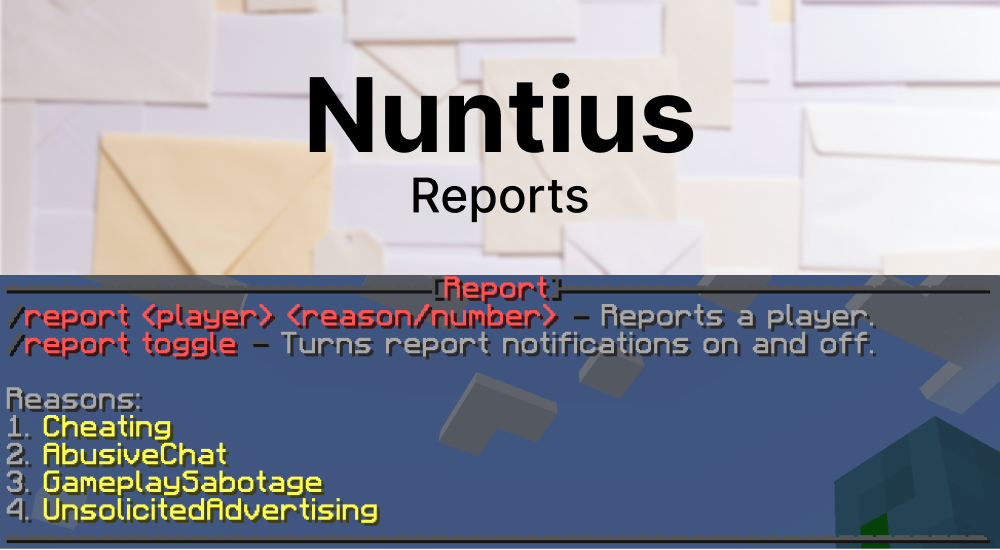

# Nuntius

Nuntius is a BungeeCord plugin that allows players to report others. Server owners can quickly and easily set preset reasons and team members have an easier time handling complaints.

## Installation

1. Download the latest release from the [GitHub](https://github.com/xp4u1/nuntius/releases).
2. Place the jar-File into your plugin directory.
3. Restart the BungeeCord server.

Now you can use Nuntius. Don't forget to add the team member permission to your BungeeCord or external rights management. 

## Features

### Reports made easy

Players can either type in one of the preset reasons or simply enter the assigned number.

`/report player 2` or `/report player abusivechat`

### Server-Jump

Team members can easily jump to the server. Even the command for this can be set in the config.

### Notifications

Team members can easily turn off their report notifications with `/report toggle`.

### Fully customizable

Each chat message can be set via the configuration file. Server owners can thus give Nuntius their very own look and adapt it to any language.
